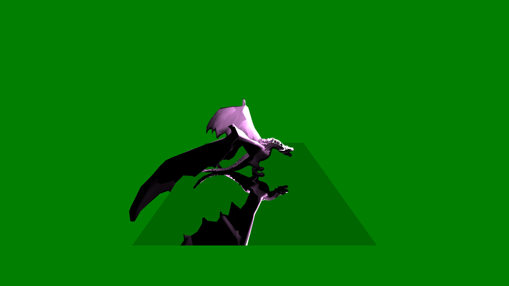

# Homework
Source repository for the home work task of the members of the Chaos Ray Tracing course

# Ray tracer for the Chaos Camp course 
This project is a ray tracer in c++. It supports perfect reflection, diffuse materials, transparency and textures. It reads a scene from a json scpecification file which contains the camera parameters, materials, lights, and objects. Here is an example of a simple json scene file with a triangle.

    {
        "settings": {
            "background_color": [
                0, 0.5, 0
            ],
            
            "image_settings": {
                "width": 1920,
                "height": 1080
            }
        },
        
        "camera": {
            "matrix": [
                1, 0, 0,
                0, 1, 0,
                0, 0, 1
            ],
            
            "position": [
                0, 0, 0
            ]
        },
        
        "lights": [
            {
                "intensity": 40,
                "position": [
                    0, 1.5, -3
                ]
            }
        ],
        
        "objects": [
            {		
                "vertices": [
                    -1.5, -1, -1.5,
                    1.5, -1, -1.5,
                    -1.5, -1, -4.5,
                    1.5, -1, -4.5
                ],
                
                "triangles": [
                    0, 1, 2,
                    3, 2, 1
                ]
            },
            {		
                "vertices": [
                    -0.5, 0, -2.5,
                    0.5, 0, -2.5,
                    0, 0.2, -3
                ],
                
                "triangles": [
                    0, 1, 2
                ]			
            }
        ]
    }

Here is a result of a more complex scene.

    
    
This scene contains many triangles, and it would takes minutes to render with a naive ray tracing algorithm. The renderer implements several acceleration techniques. Below are some results of the above image rendered with different techniques implemented, and the explanation of what they do.
| Technique                   | Render time in seconds| 
| :-----------                | :--------------:      | 
| Sequential                  | 316                   | 
| AABB                        | 187                   | 
| Region rendering            | 88                    |
|Bucket rendering             | 35                    |
|Acceleration tree            | 54                    |
|Acceleration tree and bucket | 11                    |
### AABB
For each triangle an axis aligned box is defined. It yields faster rendering time, because the box-ray intersections are faster than triangle-ray intersections.    
### Region rendering
The image is split to regions, and each one is rendered parallel. The number of regions should be about the same as the cores in the cpu.    
### Bucket rendering
The image is split to multiple small squares, which are rendered parallel. For this a threadpool is used, and the small regions are rendered row major order.
### Acceleration tree 
Acceleration tree splits up the 3D scene to boxes recursively. Each box contains some triangles, based on the tree depth. The rendering algorithm then recurses the tree, by checking the intersections of the ray and the divided parts of the space. Then when a leaf node is reached, the triangles that are contained in the region of the leaf node ara checked against the ray.   
   
# Different materials
Below are some results of other materials that are implemented.
### Diffuse
    
    
### Perfect reflection
   

### Tansparency
     
    
### Textures
    

